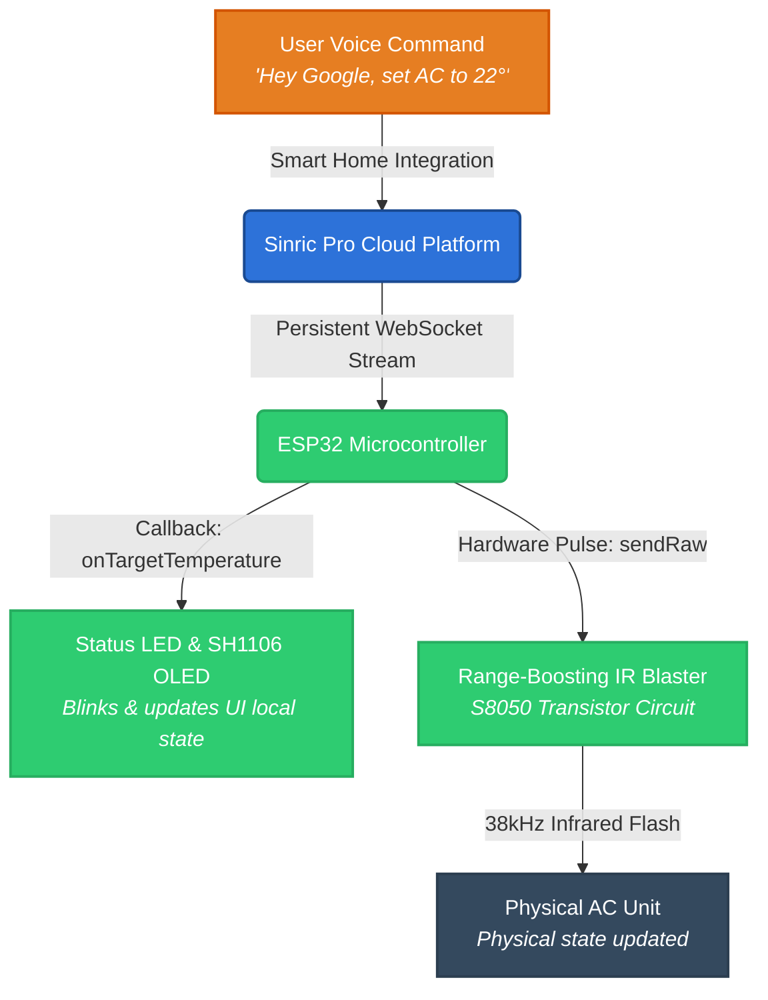

|  | <h2>Smart AC Remote Control (ESP32 + Sinric Pro)</h2><p align="center"><a href="#features">Features</a> • <a href="#hardware-requirements">Hardware Requirements</a> • <a href="#installation">Installation</a> • <a href="#usage">Usage</a> • <a href="#setup-and-installation-guide">Setup Guide</a> • <a href="#contributing">Contributing</a> • <a href="#license">License</a></p> |
|:---:|:---|

[](LICENSE)
[](https://www.arduino.cc/en/software/)
[](https://www.espressif.com/en/products/socs/esp32)

---

`Smart AC Remote Control` is an open-source, serverless IoT firmware architecture designed to convert standard "dumb" standalone air conditioning units into fully integrated smart home appliances. By combining an ESP32 microcontroller, an infrared (IR) transceiver array, and the Sinric Pro platform, this system securely bridges offline hardware with cloud voice assistants like Google Home and Alexa.

## Hardware Requirements

Ensure you have the following hardware components before configuring the firmware:

* **ESP32** Development Board (e.g., ESP32-WROOM-32E)
* **IR Receiver Module** (e.g., TSOP38238) — *Connected to GPIO 14*
* **IR Transmitter LED** — *Connected to GPIO 4 (An NPN transistor like the S8050 with a current-limiting resistor is highly recommended to boost range)*
* **SH1106 I2C OLED Display** (128x64) — *Connected to hardware SDA/SCL lines (SDA=GPIO 21 / SCL=GPIO 22)*
* **Standard Status LED** — *Connected to GPIO 2 for local visual execution feedback*

---

## Installation 

Please install the mandatory external software dependencies via your **Arduino IDE Library Manager**:

1. `IRremoteESP8266` (Provides high-precision timing arrays for carrier modulation)
2. `SinricPro` (Establishes the persistent serverless WebSocket stream)
3. `U8g2` (Handles monochrome graphics rendering for the SH1106 panel)

> **⚠️ Dependency Compilation Warning:** If your compiler throws an error pointing to multiple duplicate installations of Sinric libraries, open your local file manager, go to your Arduino `libraries` folder, and completely remove the `SinricPro_Generic` folder, leaving only the primary `SinricPro` directory.

---

## Quick Function Overview



---

## Usage

Here is a quick minimal example of how to configure your security credentials block within `02_AC_Remote_Main.ino` to establish authorization channels with your local network and cloud portal:

```cpp
#include <Arduino.h>
#include <WiFi.h>
#include <SinricPro.h>
#include <SinricProWindowAC.h>
#include "ac_codes.h"

// Set configuration variables to bind your unique hardware node
#define WIFI_SSID         "YOUR_WIFI_NETWORK_NAME"
#define WIFI_PASS         "YOUR_WIFI_PASSWORD"
#define APP_KEY           "YOUR_SINRIC_APP_KEY"
#define APP_SECRET        "YOUR_SINRIC_APP_SECRET"
#define AC_DEVICE_ID      "YOUR_SINRIC_DEVICE_ID" 
```

For comprehensive configuration file modifications, review the complete deployment map outlined in the `ac_codes.h` header file.

---

## Features

This ecosystem provides native bindings optimized around the Sinric Pro `WindowAC` device payload scheme. This ensures complete feature parity inside voice control applications using a single device slot.

### Power Interception Logic

```cpp
bool onPowerState(const String &deviceId, bool &state)
```
Toggles the binary status of your climate system. Depending on the application state variable requested by the user, this routine fires the raw timing buffers matching either `POWER_ON` or `POWER_OFF`.

### Temperature Targeting Adjustments

```cpp
bool onTargetTemperature(const String &deviceId, float &temperature)
```
Monitors precision floating-point updates across smart sliders. The system calculates step increments against an optimized baseline metric (e.g., `24°C`), dynamically emitting `TEMP_UP` or `TEMP_DOWN` pulse trains to match your remote.

### Thermostat Operational Modes

```cpp
bool onThermostatMode(const String &deviceId, String &mode)
```
Safely routes climate operational strings (such as `"COOL"` or `"AUTO"`) directly down to local raw signal matrices to modify physical parameters smoothly.

### Fan Speed Step Ranges

```cpp
bool onRangeValue(const String &deviceId, int &rangeValue)
```
Binds the native multi-tiered interface slider down to explicit hardware commands. Integer metrics (`1`, `2`, `3`) received from the remote cloud mapping are directly matched to `FAN_LOW`, `FAN_MED`, or `FAN_HIGH` raw infrared transmission buffers.

---

## Project Structure
Ensure your files are organized like this before uploading them to GitHub or opening them in the Arduino IDE:

```text
/Smart_AC_Project
│
├── 01_IR_Code_Capture.ino        # Step 1: Utility to read your physical remote
├── 02_AC_Remote_Main.ino         # Step 2: The main smart home logic
└── ac_codes.h                    # Step 2: Where you paste your captured IR arrays
```
## Setup and Installation Guide

### 1. Sniffing Your Native Remote Layout
1. Deploy `01_IR_Code_Capture.ino` straight to your microchip platform.
2. Launch the **Serial Monitor** adjusted to a standard communication baud of `115200`.
3. Direct your original factory physical controller at your receiver setup to output the accurate `uint16_t` storage arrays.

`[Insert Screenshot: Arduino IDE Serial Monitor capturing raw IR timing arrays]`

### 2. Creating Your Sinric Dashboard Portal
1. Create your account over at [portal.sinric.pro](https://portal.sinric.pro).
2. Go to your **Devices** tab and click **Add Device**.
3. Label your system profile and strictly assign the device type structure to **Window AC**.
4. Save your configuration and navigate to your main dashboard profile screen to collect your unique `App Key`, `App Secret`, and virtual `Device ID`.

`[Insert Screenshot: Sinric Pro Portal credentials pane highlighting App Key and Device ID placements]`

### 3. Final Firmware Assembly
1. Paste your custom sniffed integer sequences into their corresponding constants defined inside `ac_codes.h`.
2. Open `02_AC_Remote_Main.ino`, substitute the blank setup definitions with your real access details, and flash the software payload to start processing automated climate events!

---

## How the Logic Works

Because standard infrared signals operate purely on a unidirectional, open-loop pipeline, your ESP32 acts as a stateless transmitter. The firmware uses an event-driven design:

* State variables maintain an idealized software layout of your physical environment.
* High-precision background timers (`IRremoteESP8266`) precisely modulate a `38kHz` carrier frequency on GPIO 4 to mirror the physical remote controller.
* Local OLED graphics frameworks hook direct execution feedback variables instantly, ensuring offline diagnostic metrics are readable during execution loops.

---

## Contributing

We strongly encourage open-source community adaptations, hardware abstraction improvements, and multi-brand remote timing templates!

1. Fork the project repository.
2. Spin up your custom development patch workspace (`git checkout -b feature/AmazingFeature`).
3. Commit your layout updates safely (`git commit -m 'Add some AmazingFeature'`).
4. Push code upstream to your repository fork (`git push origin feature/AmazingFeature`).
5. Open a formal Pull Request for code integration evaluation.

---

## License

This project is licensed under the MIT License - see the [LICENSE](LICENSE) file for details.

## Acknowledgments

- Highly indebted to the `IRremoteESP8266` developer collective for maintaining precision protocol parsing platforms.
- Infinite appreciation to the Sinric Pro engineering group for establishing an accessible, ultra-low latency WebSocket cloud pipeline.

---

<p align="center">
  Made with ❤️ for the open-source IoT and smart home community

 
</p>
